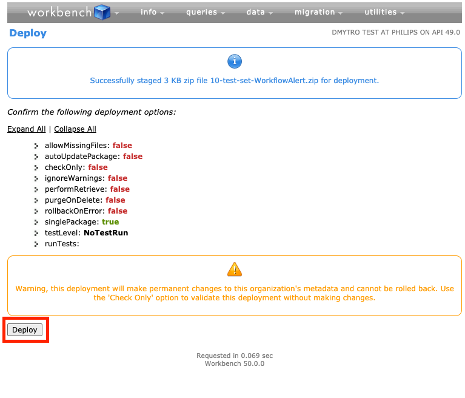

# SfXmlGenerator

This repository represents a CLI tool for generating dummy data for Salesforce org.

### How it works?

The only thing you need is to choose an entity type, the count of datasets, and the prefix of each entity.
The app would generate files and pack them into a zip archive that is ready to be deployed via [workbench](https://workbench.developerforce.com/).

### Example of usage

1. Execute the following command

   ```
   git clone https://github.com/Dmytro005/SfXmlGenerator &&
   cd ./SfXmlGenerator &&
   npm install &&
   npm start generate flows 20 test_set
   ```

2. Observe the `./dist` folder where would be located zip (`120-test-set-Flow.zip`) with your data set.

3. Log in to your SF org https://login.salesforce.com/

4. Open https://workbench.developerforce.com/ and login with your salesforce org.

5. Go to `Deploy` menu
   
6. Choose zip file, select Deploy `Single Package` and press `Next`
   
7. Press `Deploy`
   
8. Observe success result. In case of any errors occurred, connect repo contributors)
   

9. Done! Check your SF org with the generated dataset!

### Supported CLI commands

Generate archive for deployment.
```
    npm run generate [entity] [count] [prefix]
```
- entity - `string`
  - `flows` - 1 set includes 6 flows that are interlinked as a sub flows
  - `email-alerts` - 1 set includes one email alert that is attached to `Account` Object
  - `email-alerts-pb` - 1 set includes two email alert that is used in process builders and linked to `Account` Object
- count - `number` count of data sets that would be generated
- prefix - `string` string that would be attached to each entity name

---
View all commands and CLI commands
```
    npm run help
```

